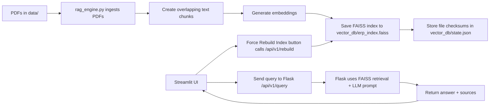

# ERP RAG System

A simple Retrieval-Augmented Generation (RAG) web application for ERP functional knowledge.

## Overview

This project ingests ERP-related PDF documents, creates a FAISS vector index from text chunks, and uses a Gemini model to answer user questions based on the indexed content.

The solution includes:
- `app.py`: Flask backend exposing a query API and a rebuild endpoint
- `streamlit_app.py`: Streamlit frontend for asking questions and forcing index rebuilds
- `rag_engine.py`: Core RAG logic for PDF ingestion, vector indexing, and document retrieval
- `requirements.txt`: Python dependencies

## Architecture

1. PDFs are stored in the `data/` folder.
2. `rag_engine.py` reads PDFs, breaks text into overlapping chunks, and creates embeddings using `sentence-transformers`.
3. FAISS stores the vector index in `vector_db/erp_index.faiss`.
4. The Flask server in `app.py` handles queries and rebuilds.
5. The Streamlit app in `streamlit_app.py` calls the Flask API to retrieve answers.

## Workflow



## Key Files

- `app.py`
  - Starts the Flask server on `127.0.0.1:5000`
  - Exposes `POST /api/v1/query` for user queries
  - Exposes `POST /api/v1/rebuild` to refresh or force rebuild the vector index

- `streamlit_app.py`
  - Provides a user interface for asking ERP questions
  - Includes a `Force Rebuild Index` button that calls the rebuild endpoint

- `rag_engine.py`
  - Loads `.env` for the Gemini API key
  - Ingests multiple PDFs from `data/`
  - Computes SHA-256 checksums for PDFs to detect updates
  - Supports incremental index updates for new PDFs and full rebuilds when content changes
  - Builds the FAISS index or appends new embeddings depending on document state

- `requirements.txt`
  - Lists required packages for this project

## Setup

1. Create and activate a Python virtual environment:

```powershell
python -m venv venv
venv\Scripts\activate
```

2. Install dependencies:

```powershell
pip install -r requirements.txt
```

3. Add your Gemini API key to a `.env` file in the project root:

```text
GEMINI_API_KEY="YOUR_API_KEY"
```

4. Place your PDF documents into the `data/` folder.

## Running the App

1. Start the Flask backend:

```powershell
python app.py
```

2. In a separate terminal, start Streamlit:

```powershell
streamlit run streamlit_app.py
```

3. Open the Streamlit UI in your browser (usually at `http://localhost:8501`).

## Usage

- Enter an ERP question in the Streamlit input field.
- Click `Generate Guidance` to query the backend.
- Use `Force Rebuild Index` when you add or update PDFs in `data/`.

## Notes

- The project stores the vector index in `vector_db/erp_index.faiss`.
- A state file `vector_db/state.json` is used to track PDF file checksums and chunk count.
- If the index is stale or files are changed, the rebuild endpoint will refresh the index.
- The Streamlit UI reports backend errors directly for easier debugging.

## Troubleshooting

- If Streamlit shows a connection error, verify the Flask server is running on port `5000`.
- If the RAG response returns a model error, check the Gemini model name in `rag_engine.py` and the API key in `.env`.
- To force a fresh rebuild, either use the Streamlit `Force Rebuild Index` button or delete `vector_db/erp_index.faiss` and restart `app.py`.
- If you see only `O2C` results, the vector index may still contain all PDFs. Retrieval uses nearest-neighbor scoring, so a query can return mainly O2C chunks if they are most relevant.

## Optional Improvements

- Add more PDF documents under `data/`.
- Extend the prompt in `rag_engine.py` for more structured ERP guidance.
- Add source highlighting or larger context support in the Streamlit output.

## Developer Notes

- `vector_db/erp_index.faiss` stores the FAISS vector index for all PDF text chunks.
- `vector_db/state.json` stores:
  - `file_order`: the ordered list of PDF filenames processed
  - `file_checksums`: SHA-256 hashes for each PDF file
  - `chunk_count`: the number of text chunks currently indexed
- On startup, `rag_engine.py` compares current PDF checksums with saved state:
  - if files were changed or removed, it rebuilds the full index
  - if new files were added, it appends only the new embeddings
  - if there is a mismatch in chunk count, it rebuilds the index
- Use `POST /api/v1/rebuild` or the Streamlit `Force Rebuild Index` button to force a full refresh.
- Deleting `vector_db/erp_index.faiss` will also force a full rebuild on the next run.
